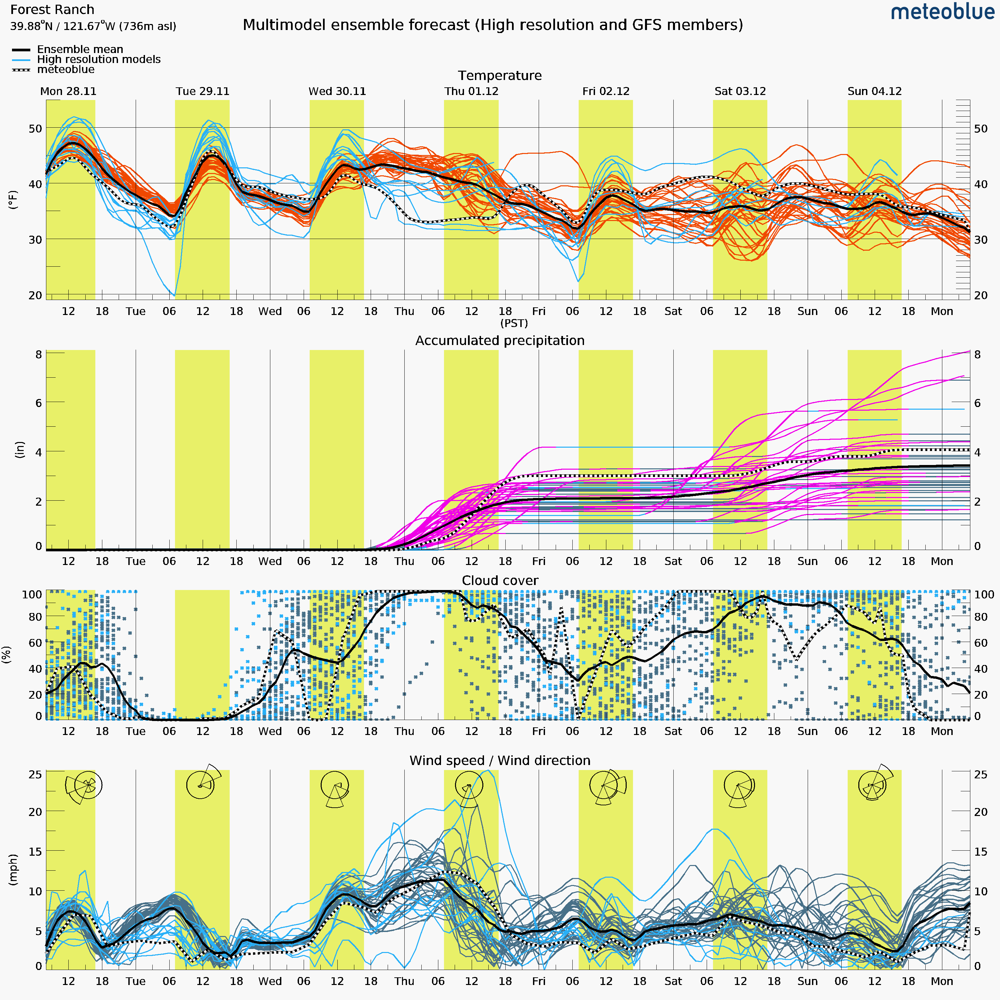
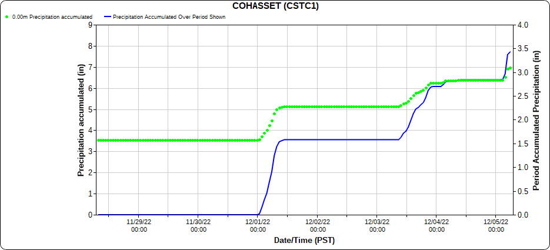

```{r setup, include=FALSE}
knitr::opts_chunk$set(echo = TRUE)
```

```{css float-right-figure-caption, echo = FALSE}
.my-right-figure {
  display: table;
  float: right;
  padding-left: 30px;
  padding-bottom: 10px;
}
.my-right-figure p + p {
  display: table-caption;
  caption-side: bottom;
  padding-left: 30px
}
.figure {
  display: contents;
}
```

# Nov. 21 - 27

Nothing exciting for the next few days (slight warming trend), then chances for precip return starting Sat/Sun

__This week:__

* Daytime RH's at their lowest today and tomorrow (high 20s)
* Daytime lows high 30s/low 40s otherwise
* Light north winds,though some models indicate a chance for some gusts in the afternoons through Thursday

__Weekend:__ 

* Start to see chances for precip starting Saturday (<20%)
* Meaningful chances for precip start on Sunday (50%)

__Beyond:__

* Storm door looks to stay open into the first week of December

__Fuels:__

* 100hrs near all-time low
* 1000hrs near average


# Nov. 28 - Dec. 4

Winds today, dry tomorrow, and wet starting Wednesday continuing into the weekend. 

## Today, Tomorrow, Wednesday
West winds today, shifting to the North overnight into tomorrow, then setting up out of the South as the storm moves in. Not forecasting much gustiness, 5-10mph. 

__Later in the week:__

* Moisture and winds moving in on Wednesday afternoon with snow levels starting high then lowering as low as 2/3kft by Thursday morning. Around 2" of moisture is expected by late Thursday.
* A break on Friday
* There's still some uncertainty with the magnitude and timing of Saturday's storm (see the wide variation in precipitation predictions for Saturday below). 

[{width=75%}](https://www.meteoblue.com/en/weather/forecast/multimodelensemble/forest-ranch_united-states_5349956){target="_blank"}


# Dec. 5 - 11

Storm moves out of the region this afternoon. Dry and clear on Wednesday, then another pair of storms late Thursday-Friday and Saturday-Sunday. 

__Recap:__ Significant precipitation fell across the region since early Thursday morning. The RAWS at Cohasset and Quincy recieved nearly 3.5 inches of moisture.


<!-- [{width=75%}](https://mesowest.utah.edu/cgi-bin/droman/meso_base_dyn.cgi?stn=CSTC1&unit=0&time=LOCAL&product=&year1=2022&month1=12&day1=05&hour1=07&hours=24&graph=1&past=1&order=1)[r] -->

:::{.my-right-figure}
```{r echo=FALSE, fig.align='right', fig.cap='<a href="https://mesowest.utah.edu/cgi-bin/droman/meso_base_dyn.cgi?stn=CSTC1&unit=0&time=LOCAL&product=&year1=2022&month1=12&day1=05&hour1=07&hours=24&graph=1&past=1&order=1">mesowest</a>'}

#
```
:::

__Two storms this week:__ A quick-moving storm could bring up to an inch of moisture to the Forest Ranch area late Thursday night into early Friday morning. The second storm arrives later Friday afternoon and looks to be much wetter: 2.5 inches of moisture could fall between late Friday afternoon and Sunday morning. 

# Dec. 12-18

__Recap__: The wettest storm of the 2022-23 winter so far is leaving the region today. Anywhere from 2-4" of moisture fell between Thursday and Sunday night, depending on elevation and topographic position. The Forest Ranch area picked up around 2.5". Most Sierra weather stations have received many times the snow-water-equivalent for this point in the water year so far. 


__Near-term__: Most of northern California will see lower than average temperatures this week. Daytime highs in the mid-40s and lows near freezing for the foothills of Butte county. After the system moves out today (Monday), we are looking dry through at least Thursday. There are chances for another round of light precipitation over the weekend, but those chances have trended downwards over the last few days. 


__Long-term__: Per a few sources ([Danial Swain](weatherwest.com), but also [NWS Climate Prediction Center](https://www.cpc.ncep.noaa.gov/)), our future is more likely to be drier-than-average than wetter-than-average. 


# Dec. 19-25

We've remained dry since the last round of storms moved out of the region on Monday (12/12) morning. Recapping the water year so far in terms of snowpack, all three regions of the Sierra are doing pretty good...

```{r snowpack, echo=FALSE, fig.align='center', fig.cap='<a href="https://cdec.water.ca.gov/snowapp/sweq.action">CA DWR</a>'}
knitr::include_graphics("12.19/SierraSnowpack_12.19.jpg")
```

In terms of precipitation (not just snowpack), the story for Butte county is different for the valley vs. the foothills and mountains. The flat lands look to be just below average over the last 30 days, while the uplands are riding just above average. 

```{r droughtandmeso, echo=FALSE,out.width="49%", out.height="20%",fig.cap='Drought.gov and Mesowest', fig.show='hold',fig.align='center'}
knitr::include_graphics(c("12.19/30-day-percent-of-normal-precipitation-12-19-2022.png","12.19/cohasset_last30days.png"))
``` 

__This Week__: Generally, cloudy skies with valley fog, high Rh's (60-70), and light winds are the story this week.  We see some chances for precipitation on Tuesday evening into Wednesday morning for the foothills, but accumulations don't look to be higher than two tenths of moisture. A smaller cell of moisture passes through on Thursday night into Friday, but we likely won't see any rain or snow in Butte county. We might see some slightly elevated winds out of the north ahead of this cell early Wednesday morning. Strong inversion forecasted for this weekend, meaning valley fog and above-average temperatures in the foothills/mountains. 

__Next Week__: There are signs pointing towards the potential for wetter conditions returning by the middle of next week. The mixed signals are classic: some models show meaningful precipitation impacting the Sierras, while others show the storm track staying just to our north.

```{r twomods, echo=FALSE,out.width="49%", out.height="20%",fig.cap='Story of two models. Left: Only far northern CA  sees a taste of precip, Right: low pressure (and precip) sets in over the northern half of CA.', fig.show='hold',fig.align='center'}
knitr::include_graphics(c("12.19/500h_anom.na_EMCWF_12.28.png","12.19/500h_anom.na_GFS_12.28.png"))
``` 

